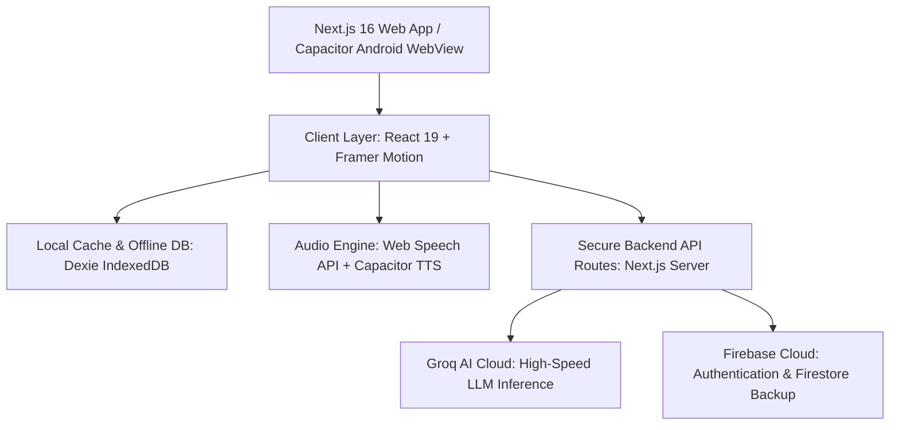

# SMRITI (स्मृति) — Cognitive Care & Memory Companion for Elders

<div align="center">


**A calm, human-centric, and culturally grounded cognitive companion designed for elderly individuals and their caregivers.**

[](https://nextjs.org/)
[](https://reactjs.org/)
[](https://www.typescriptlang.org/)
[](https://tailwindcss.com/)
[](https://capacitorjs.com/)
[](https://groq.com/)
[](https://firebase.google.com/)

[Live Demo](https://smriti-sih.vercel.app) • [Architecture](#-architecture--tech-stack) • [Features](#-core-features) • [Installation](#-getting-started) • [Mobile APK Build](#-building-the-android-apk)

</div>

---

## 📖 Overview

As individuals age, cognitive decline and memory-related challenges (such as mild cognitive impairment and Alzheimer's) often create feelings of disorientation, isolation, and distress. Existing digital health apps are frequently clinical, cold, English-only, and complex for senior citizens to navigate.

**SMRITI (स्मृति)** reimagines digital cognitive care as a warm, familiar, and culturally grounded experience. Built specifically for Indian seniors and their families, SMRITI combines gentle voice interactions in Hindi and English, personalized family memory recall, and cognitive stimulation activities designed with zero stress and maximum dignity.

---

## 🌟 Core Features

### 1. 🎙️ Dedicated Voice AI Companion (`/voice`)
- **Conversational Voice Assistant**: Elders can simply talk instead of typing.
- **Warm Persona**: SMRITI speaks with patience, respect (*"आप"*), and cultural familiarity.
- **Multimodal Pipeline**: Combines Speech-to-Text (STT) + Groq Fast LLM Inference + Native Capacitor Text-to-Speech (TTS).
- **Interactive Chat Interface**: Large, high-contrast speech bubbles with bouncing typing indicators and real-time audio playback.

### 2. 🧠 Cognitive & Memory Stimulation Activities
- 📖 **Story Time & Memory Recall**: Cultural stories generated dynamically in Hindi/English with interactive comprehension checks.
- 🎴 **Memory Card Matching**: Calming visual pair-matching game with gentle feedback and progressive difficulty.
- 👨‍👩‍👧‍👦 **Family Recognition Quiz**: Dynamic quiz generated directly from real family photos uploaded by caregivers to reinforce familiar faces and relations.
- 🧩 **Gentle Tetris**: A calm, simplified spatial coordination game crafted to encourage motor and cognitive agility without stressful timers.

### 3. 📸 Family Memory Bank (`/family`)
- **100% Real Personal Data**: Zero placeholder data—elders see actual photos, names, relations, and stories of their children, grandchildren, and friends.
- **Offline-First Storage**: Powered by IndexedDB (`Dexie.js`) so family photos and memories remain instant, private, and accessible even without internet.
- **Daily Featured Face**: Rotates a loved one's photo and memory note on the dashboard every morning.

### 4. 🛡️ Caregiver Dashboard & Support (`/caregiver`)
- Caregivers can securely add family members, upload photos, record memory notes, and track daily activity check-ins.
- Role-based onboarding for both Elders and Caregivers.

### 5. ♿ Elder-First Accessibility Design System
- **Touch Targets**: All buttons and interactive elements maintain a minimum 48px touch target.
- **Calm Color Palette**: Deep Terracotta (`#8B3A3A`), Sand Surface (`#FAF6F0`), and Slate Text (`#26332F`) to avoid clinical starkness.
- **Bilingual Experience**: Instant switching between Hindi (हिंदी) and English.

---

## 🏗️ Architecture & Tech Stack



| Layer | Technologies Used |
|---|---|
| **Framework** | Next.js 16 (App Router, Turbopack), React 19, TypeScript |
| **Styling** | Tailwind CSS, CSS Custom Properties Design System |
| **Animations** | Framer Motion |
| **Offline Database** | Dexie.js (IndexedDB) with `dexie-react-hooks` |
| **Cloud & Auth** | Firebase Authentication (Google OAuth + Email/Password), Cloud Firestore |
| **AI Brain** | Groq LPU API (`openai/gpt-oss-20b` / `llama-3.1`) |
| **Speech & Audio** | Native Web Speech Recognition API, `@capacitor-community/text-to-speech` |
| **Mobile Runtime** | Capacitor JS (Android SDK 34+) |

---

## 🚀 Getting Started

### Prerequisites
- **Node.js**: `v18.17.0` or higher
- **npm** or **yarn** / **pnpm**
- (Optional for Android builds) **Android Studio** & **Java JDK 17+**

### 1. Clone the Repository
```bash
git clone https://github.com/Nirmit-Angane/SIH_2026-SMRITI.git
cd SIH_2026-SMRITI
```

### 2. Install Dependencies
```bash
npm install
```

### 3. Setup Environment Variables
Create a `.env.local` file in the root directory:

```env
# Firebase Configuration
NEXT_PUBLIC_FIREBASE_API_KEY="your_firebase_api_key"
NEXT_PUBLIC_FIREBASE_AUTH_DOMAIN="your_project.firebaseapp.com"
NEXT_PUBLIC_FIREBASE_PROJECT_ID="your_project_id"
NEXT_PUBLIC_FIREBASE_STORAGE_BUCKET="your_project.firebasestorage.app"
NEXT_PUBLIC_FIREBASE_MESSAGING_SENDER_ID="your_sender_id"
NEXT_PUBLIC_FIREBASE_APP_ID="your_app_id"
NEXT_PUBLIC_FIREBASE_MEASUREMENT_ID="your_measurement_id"

# Groq AI Key (Server-side only)
GROQ_API_KEY="gsk_your_groq_api_key"
```

### 4. Run Development Server
```bash
npm run dev
```
Open [http://localhost:3000](http://localhost:3000) in your browser.

---

## 📱 Building the Android APK

SMRITI is fully optimized to run as a native Android APK using Capacitor.

```bash
# 1. Build production web assets
npm run build

# 2. Sync web bundle to Android native project
npx cap sync android

# 3. Open project in Android Studio
npx cap open android
```

In Android Studio:
1. Select **Build** → **Build Bundle(s) / APK(s)** → **Build APK(s)**.
2. The generated APK will be located at:
   `android/app/build/outputs/apk/debug/app-debug.apk`

---

## 📂 Project Structure

```text
SIH_2026/
├── app/                        # Next.js App Router
│   ├── activities/             # Cognitive Activity Pages (Memory, Stories, Quiz, Tetris)
│   ├── api/                    # Secure Server API Routes
│   │   ├── assistant/chat/     # Groq Voice Assistant endpoint
│   │   ├── story/generate/     # AI Cultural Story Generator endpoint
│   │   └── tts/                # Text-to-Speech fallback endpoint
│   ├── caregiver/              # Caregiver portal & management
│   ├── dashboard/              # Elder Home Dashboard
│   ├── family/                 # Family Memory Bank
│   ├── voice/                  # Dedicated Voice AI Conversation page
│   ├── layout.tsx              # Root Layout with Theme & Language Providers
│   └── page.tsx                # Landing Page
├── components/                 # Reusable UI Components
│   ├── activities/             # Game & Activity components
│   ├── assistant/              # VoiceChat & Audio visualizers
│   ├── auth/                   # Login, Signup, ProtectedRoute
│   ├── family/                 # Family grid, Photo upload, Memory modals
│   ├── home/                   # Dashboard widgets (Greeting, Timeline, Familiar Face)
│   └── landing/                # Landing sections (Hero, Features, Trust)
├── hooks/                      # Custom React Hooks (useAuth, useInterval)
├── lib/                        # Business Logic & Data Layer
│   ├── db/dexie.ts             # IndexedDB schema & database tables
│   ├── family/                 # Family & Memory storage helpers
│   ├── firebase/               # Firebase SDK initialization
│   └── i18n/                   # Bilingual dictionary (English / Hindi)
├── public/                     # Static assets & icons
└── capacitor.config.ts         # Mobile Capacitor configuration
```

---

## 🔒 Privacy & Security

- **Server-Side AI Secrets**: All AI API tokens reside strictly on the server side and are never exposed to the client bundle.
- **Local-First Data**: Family photos and personal relationship details can be stored purely on the device's IndexedDB for maximum elder privacy.
- **Authorized Domains**: Strict Firebase Auth OAuth security preventing unauthorized domain redirects.

---

## 🏆 Smart India Hackathon (SIH 2026)

Developed with ❤️ to empower our elders, preserve cherished family memories, and bring compassionate AI companionship to every Indian household.

---

## 📄 License

This project is licensed under the MIT License - see the [LICENSE](LICENSE) file for details.
